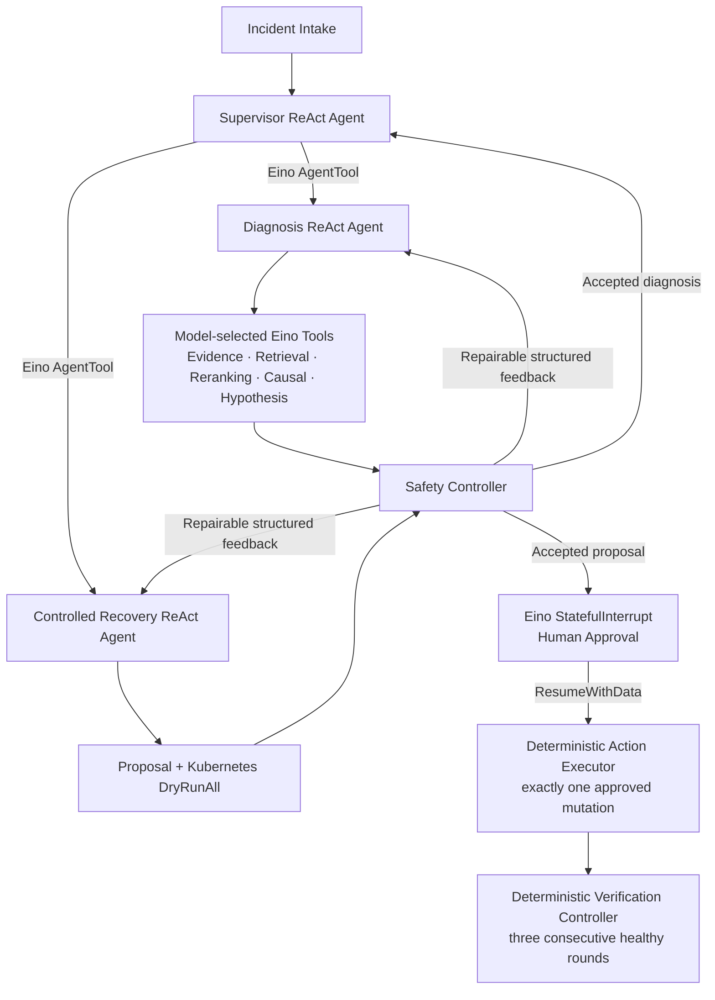

# KubePilot-AIOps

[English](README.md) | [简体中文](README.zh-CN.md)

KubePilot is an Eino-native **Constrained ReAct Autonomous SRE Agent** for Kubernetes incident diagnosis and safe recovery. Three nested Eino ADK Agents autonomously choose bounded investigation and proposal capabilities, while a deterministic Safety Controller owns invariants, approval, mutation, and verification.

The control plane is implemented in Go with Gin and Eino. It receives Alertmanager events, correlates alerts, collects metrics/logs/traces/Kubernetes evidence, performs evidence-grounded diagnosis, proposes a constrained recovery action, pauses for approval, executes through `client-go`, and verifies the result. Prometheus, Loki, Jaeger, Milvus, PostgreSQL, Redis, and the official Drain3 parser provide the Agent's evidence and state infrastructure.

## Architecture

```text
Minikube: gateway → order → payment → MySQL/Redis
    │          metrics / logs / OTLP traces
    ▼
Docker Compose: Agent + Log Indexer + PostgreSQL + Redis + Prometheus
                + Loki + Jaeger + Grafana + Milvus + Drain3 sidecar
```

Drain3 is not on the Incident query path. The independent Go Log Indexer continuously consumes Loki, sends identified and idempotent batches to Drain3 over WebSocket, embeds templates with the configured BGE endpoint, and writes the template index to PostgreSQL and Milvus. Incident queries read Loki plus the prebuilt index and fall back to Loki when index freshness is insufficient.

## Agent architecture



- **Constrained ReAct instead of a hard-coded investigation graph:** the model chooses each Agent business ToolCall and may change tool order or parallelize calls. The outer Eino graph is only the deterministic safety skeleton: intake, Agents, proposal validation, approval interrupt, exact execution, verification, and finalization.
- **Exactly three nested ADK Agents:** Supervisor acts as incident commander and delegates through Eino AgentTools; Diagnosis explores evidence and falsifiable hypotheses; Recovery creates and dry-runs one proposal. Recovery cannot discover mutation, approval-data, or verification tools.
- **Pinned Agent Skills:** each Agent receives an independent `SKILL.md` through Eino middleware. Skills define role, boundaries, decision criteria, capability semantics, and output schema—not a hidden tool sequence. Skill hashes are pinned to the Incident and checkpoint, so changed instructions cannot silently resume an old workflow.
- **Safety is a feedback environment:** repairable violations return a scoped `SafetyFeedback` observation to the same ReAct loop. Feedback states missing conditions without prescribing a tool or revealing an answer. Fatal policy violations stop immediately; infrastructure failures and exhausted correction budgets require a human.
- **Four-dimensional budgets:** every Agent and the whole Incident enforce max iterations, Tool Count, pinned Tool Cost, provider tokens, and a separate correction budget. Parallel calls are charged atomically, AgentTool delegation is charged at both parent and Incident scope, and resume never resets usage.
- **Typed, resumable workflow:** the named `WorkflowState`, Evidence schema, Dry-run result, and server-owned ExecutionContext are checkpointed in Redis. PostgreSQL remains the auditable long-term business store.
- **Evidence-grounded hypothesis lifecycle:** Evidence is attributed to the current time, service/resource, Trace/request/Pod, and causal path before ranking. Diagnosis maintains at most three hypotheses through `CREATED → EVIDENCE_SEARCHING → SUPPORTED/REFUTED → ACCEPTED`; confidence can rise or decay as support and contradiction change. The model prior is deliberately the smallest positive term.
- **True hybrid incident retrieval:** three parallel Eino Tools recall semantic Milvus candidates, PostgreSQL lexical candidates, and cross-service topology candidates. Weighted RRF keeps 30 candidates and an explainable feature reranker sends only the top five into diagnosis; every score component and ranking reason is persisted.
- **Optional neural reranking API:** evidence and historical incidents have separate ranking policies and fusion formulas: `0.70 deterministic + 0.30 neural` for evidence, and `0.45 deterministic + 0.55 neural` for historical incidents. A user-configured OpenAI-compatible reranking API can add neural relevance; unavailable neural ranking is explicitly marked and deterministic weights are renormalized rather than fabricating a score. Both `EvidenceRankBreakdown` and `IncidentRankBreakdown` are persisted for reproducibility. The endpoint is hot-reloaded and pinned by configuration hash.
- **Topology-aware reasoning:** Jaeger call relationships, Kubernetes Service/Endpoint and owner links, known data dependencies, and error propagation paths form an Incident Dependency Graph. This supports cross-service retrieval when different workloads fail through the same critical dependency.
- **Causal knowledge:** built-in and learned cause-to-symptom paths are stored in PostgreSQL with audit history. Only high-confidence, approved, successfully verified incidents from configured non-evaluation namespaces can contribute, and two independent incidents are required before a learned pattern becomes active.
- **Evolving incident knowledge:** resolved Incidents pass through a server-side Knowledge Evolution Layer. Trace/Kubernetes/Evidence graphs normalize pod/IP identities into reusable `business-service → database/cache/queue` patterns, merge them by deterministic signatures, and expose them to topology retrieval. Causal proposals are grounded in the accepted hypothesis ledger and real Evidence, then validated for complete paths, independent sources, contradiction, and repeated support before entering pending/active knowledge. Agent Tools can read, propose, and validate; only the resolved-Incident extractor can write.
- **Causal pattern discovery:** a separate server-side discovery engine extracts Incident Causal Graphs from independently verified resolutions, mines repeated paths, records explicit counter-observations, scores candidates deterministically, and persists only candidates that pass the existing causal validator. Diagnosis can read accepted discovered patterns through `retrieve_discovered_causal_patterns`; it cannot write or promote them.
- **Discovery evaluation:** `go run ./cmd/benchmark intelligence` includes a deterministic 100-resolved-Incident discovery corpus and reports pattern precision/recall plus confidence calibration; this evaluator is isolated from production learning and formal fault-injection scoring.
- **Central capability registry:** every Agent-visible business capability is an Eino Tool with JSON Schema, Agent allowlist, timeout, argument/output bounds, and pinned cost. Tools never accept raw SQL, PromQL, LogQL, kubectl, shell, Milvus filters, or arbitrary Kubernetes manifests. Production Agent code is AST-tested to reject hand-built `schema.ToolCall` values.
- **Official streaming model components:** OpenAI-compatible and Anthropic-compatible protocols use the pinned Eino extension packages. Eino assembles fragmented streaming Tool Calls; URL, API path, key, and model remain user-configured.
- **Capability gating:** the Agent performs a side-effect-free Tool Calling probe before enabling recovery. A chat endpoint that cannot produce the required structured tool call remains diagnosis-disabled rather than executing an unsafe fallback.
- **Pre-indexed hybrid logs:** the query Tool combines Loki metadata/keyword results with the continuously maintained Drain3/BGE/Milvus index; it never waits for synchronous log parsing.
- **Human-in-the-loop recovery:** Recovery can propose only `restart_pod`, `scale_deployment`, or `rollback_deployment`. Kubernetes `DryRunAll` must succeed before approval. Execution requires an unexpired proposal, server-generated ExecutionContext, idempotency key, namespace allowlist, mutation hash, UID, and resourceVersion.
- **Closed-loop verification:** after execution, the deterministic Verification ToolsNode samples workload health repeatedly and persists the final Incident, proposal, approval, audit, and verification state in PostgreSQL.
- **Agent observability without Chain-of-Thought:** Eino callbacks persist tool lifecycle, budget, hypothesis transitions, confidence history, scoped Safety feedback, and `AgentDecisionEvent` action categories to OpenTelemetry, Prometheus, PostgreSQL, and Incident SSE. Hidden reasoning, credentials, endpoints, and unbounded raw logs are never recorded.
- **Ablation-ready design:** the same runner can evaluate `llm-only`, `vector-rag`, and full `kubepilot` paths, making the contribution of retrieval and multi-source agents measurable.

## Prerequisites

- macOS or Linux with at least 16 GB RAM; 24 GB available to containers is recommended.
- Go 1.26.2.
- Docker/Colima, Minikube, kubectl, and Helm.
- One OpenAI-compatible or Anthropic-compatible chat endpoint with tool calling.
- One embedding model exposed through an OpenAI-compatible embeddings endpoint.

Size the container runtime and Minikube allocations for the available host resources. Keep sufficient memory for PostgreSQL, the observability stack, Milvus, and the Kubernetes workloads when running the full benchmark.

## Configuration

```bash
cp .env.example .env
```

Required settings:

```env
API_TOKEN=...
ALERTMANAGER_WEBHOOK_TOKEN=...
CHAT_PROTOCOL=openai-compatible       # or anthropic-compatible
CHAT_BASE_URL=https://...
CHAT_API_PATH=/chat/completions       # /v1/messages for Anthropic
CHAT_API_KEY=...
CHAT_MODEL=...
CHAT_MAX_RETRIES=1                    # retry transient transport errors, 429, and 5xx once
CHAT_REASONING_EFFORT=low            # optional for reasoning models
CONFIG_RELOAD_INTERVAL=2s            # poll the mounted .env without restarting Agent
CONFIG_RELOAD_RETRY_INTERVAL=30s     # retry a candidate that failed capability probing
EMBEDDING_BASE_URL=https://...
EMBEDDING_API_PATH=/embeddings
EMBEDDING_API_KEY=...
EMBEDDING_MODEL=your-embedding-model
EMBEDDING_DIMENSIONS=1024
EMBEDDING_BATCH_SIZE=10               # lower this if the provider caps batch input
EMBEDDING_REQUEST_INTERVAL=1s         # provider rate-limit pacing; 429/5xx are retried
RERANKER_ENABLED=false                # optional OpenAI-compatible reranking API
RERANKER_PROTOCOL=openai-compatible
RERANKER_BASE_URL=https://...
RERANKER_API_PATH=/reranks
RERANKER_API_KEY=...
RERANKER_MODEL=<your-reranker-model>
MODEL_EVIDENCE_MAX_ITEMS=12
MODEL_CONTEXT_MAX_BYTES=32768
SUPERVISOR_MAX_TOOL_USES=8
DIAGNOSIS_MAX_TOOL_USES=15
RECOVERY_MAX_TOOL_USES=10
INCIDENT_MAX_AGENT_TOOL_USES=30
CAUSAL_LEARNING_NAMESPACES=kubepilot-demo
DRAIN3_TOKEN=...
BUSINESS_PROBE_URL=...                # optional end-to-end recovery probe
```

Secrets are read only from environment variables or the untracked `.env`. Health responses, logs, traces, and benchmark manifests never include keys.
The Docker build context also excludes `.env`, generated runtime credentials, and benchmark artifacts.

All Agent model nodes use Eino streaming. OpenAI-compatible SSE deltas and Anthropic `input_json_delta` fragments are merged by Eino before a Tool executes.

The Agent watches the read-only mounted `.env` for chat and reranker configuration changes. A candidate client replaces the active client atomically only after validation and probing. A failed candidate leaves the previous client active, and each Incident pins model, Skill, ranking-policy, and reranker hashes for its complete workflow. API keys and full endpoints are never exposed by health responses, logs, or checkpoints.

The checked-in Alertmanager development receiver uses `change-alert-token`; set the same value in `.env` for the first local run or replace it in `deploy/docker/alertmanager/alertmanager.yml`.

## Local deployment

```bash
make bootstrap
make doctor
make up
```

`make up` performs these stages:

1. Starts Colima and a Calico-enabled Minikube cluster.
2. Generates a container-safe kubeconfig and Prometheus client credentials under `.runtime/`.
3. Starts PostgreSQL, Redis, Drain3, Prometheus, Alertmanager, Loki, Grafana, Jaeger, Milvus, and dependencies.
4. Builds and loads the Go demo-service image.
5. Deploys demo and benchmark namespaces plus Alloy and kube-state-metrics.
6. Starts the Go Log Indexer and the Go Agent.

Local endpoints:

| Component | URL |
|---|---|
| KubePilot | http://localhost:8080 |
| Grafana | http://localhost:3000 |
| Prometheus | http://localhost:9090 |
| Alertmanager | http://localhost:9093 |
| Loki | http://localhost:3100 |
| Jaeger | http://localhost:16686 |

Stop while preserving data with `make down`. `make destroy` explicitly confirms before deleting the Minikube cluster and Compose volumes.

## Ten-minute demonstration

1. Open KubePilot and enter `API_TOKEN` in the local UI.
2. Confirm model configuration:

   ```bash
   curl -H "Authorization: Bearer $API_TOKEN" http://localhost:8080/api/v1/model/health
   curl -X POST -H "Authorization: Bearer $API_TOKEN" http://localhost:8080/api/v1/model/probe
   ```

3. Send traffic to the gateway:

   ```bash
   kubectl -n kubepilot-demo port-forward service/gateway-service 18080:8080
   curl http://localhost:18080/checkout
   ```

4. Create a controlled fault in the benchmark namespace:

   ```bash
   make benchmark-smoke
   ```

5. Inspect the incident's evidence and recovery proposal, approve it in the UI, and observe verification.
6. Follow the correlated metrics, logs, and traces in Grafana and Jaeger.

## API

The public specification is at `api/openapi.yaml`. All `/api/v1` routes require `Authorization: Bearer <API_TOKEN>` except the Alertmanager endpoint, which uses its own webhook token. Recovery approval also requires `Idempotency-Key`.

Causal patterns can be inspected and enabled/disabled through `/api/v1/knowledge/causal-patterns`; every status change is authenticated and audited. `/api/v1/incidents/{id}/hypotheses` exposes the hypothesis ledger, `/agent-runs` exposes budget and decision events without hidden reasoning, and `/api/v1/reranker/health` and `/probe` expose redacted reranker state.

Example manual incident:

```bash
curl -X POST http://localhost:8080/api/v1/incidents \
  -H "Authorization: Bearer $API_TOKEN" \
  -H 'Content-Type: application/json' \
  -d '{"severity":"critical","service":"payment-service","namespace":"kubepilot-demo","resource":"payment-service","summary":"HTTP 500 increased"}'
```

## Benchmark

### Autonomous Incident Benchmark

In addition to the existing live fault-injection profiles, the repository contains an isolated evaluator framework under `benchmark/component`, `benchmark/reasoning`, `benchmark/agent`, `benchmark/incident`, `benchmark/evolution`, `benchmark/evaluator`, and `benchmark/reports`. It measures the complete public lifecycle—incident input, diagnosis, proposal, approval, execution, verification, and observed knowledge evolution—without importing the Agent runtime. `benchmark/manifests/v2.yaml` records the reproducibility contract.

The evaluator keeps expected root cause, evidence, recovery, and causal-path labels outside the Agent payload. The public incident harness accepts only observations, and the optional evolution sink receives observed resolved incidents only. This provides explicit isolation tests in `benchmark/isolation` and deterministic Recall@K, Precision@K, MRR, NDCG, hypothesis, tool-efficiency, correction, recovery-safety, verification, MTTD/MTTR, topology, and causal-evolution metrics.

Validate the contract without starting a live benchmark:

```bash
go run ./cmd/benchmark validate-v2
```

Formal full runs remain opt-in and still use the existing `make benchmark-*` commands; no generated report or runtime log is part of the source tree.

The scenario catalog is not a collection of arbitrary shell commands. `benchmark/incidents.yaml` expands deterministically into exactly 100 typed cases:

| Category | Cases |
|---|---:|
| CPU | 20 |
| Memory leak/OOM | 20 |
| Database | 20 |
| Network | 20 |
| Deployment | 20 |

Validate without a cluster:

```bash
make benchmark-validate
```

Run profiles:

```bash
make benchmark-smoke       # 5 cases
make benchmark-standard    # all 100 cases, serial and isolated
make benchmark-diagnosis-compare # 100 cases each for LLM-only, Vector-RAG, and full KubePilot
make benchmark-correlation # send 100 ground-truth groups through the live Agent webhook
make benchmark-retrieval   # load 500,000 logs through Loki, Drain3, embeddings, and Milvus
make benchmark-full
```

`standard`, `correlation`, and `retrieval` source `.env`. Formal runs require a real tool-capable chat model and a real OpenAI-compatible embedding endpoint; local mock responses are contract-test data only and are never reported as formal results. The report records the actual embedding model and dimensions, so results from different models remain distinguishable.

Retrieval runs in the separate `kubepilot-retrieval` Compose project. It owns independent Loki (port 3200), Drain3 (port 8181), Milvus (port 19531), etcd, MinIO, Docker network, and volumes; it never writes to the Diagnosis/Agent observability or history stores. Every run removes and recreates this project's volumes before ingestion, and Milvus collections are additionally isolated by run ID. Diagnosis and correlation targets restore the Kubernetes baseline and clear only short-lived Agent/observability caches before starting; completed reports and run metadata are retained.

Interrupted runs can be resumed and reports regenerated with:

```bash
go run ./cmd/benchmark resume --run-id <run-id>
go run ./cmd/benchmark report --run-id <run-id>
```

The Kubernetes injector only executes compiled action types. It refuses namespaces other than `kubepilot-benchmark`, snapshots affected resources, runs one case at a time, and restores the baseline on success, failure, cancellation, or timeout. A cleanup failure stops the run.

Each run produces a manifest, case JSONL, summary JSON, CSV tables, and Markdown report under `artifacts/benchmark/<run-id>/`. Manifests include the catalog hash, model protocol/name, endpoint hash, seed, and configuration hashes, but no credentials.

Metrics include strict root-cause accuracy, category/service/resource accuracy, evidence recall, recovery decision accuracy, Tool Count/Cost and correction usage, confidence history, diagnostic/recovery latency, alert grouping precision/recall/F1, retrieval Recall@K/MRR, and P50/P95/P99. Retrieval reports `loki`, `semantic`, `hybrid`, and `causal_hybrid`; when a real reranker is configured it additionally reports `neural_causal_hybrid`, including lexical, topology, fusion, deterministic/neural rerank, and causal-stage latency. Formal reports contain measured results only.

The diagnosis comparison evaluates three methods against the same injected Kubernetes scenarios: `llm-only` receives only incident metadata, `vector-rag` receives incident metadata plus seeded historical incidents, and `kubepilot` collects Metric, Log, Trace, Kubernetes, and historical evidence. Root-cause localization requires exact category, one of the 21 canonical fault variants, service, and resource matching; strict accuracy additionally requires at least 50% required-evidence recall. Reports include per-category precision/recall/F1, a confusion matrix, evidence precision/recall and groundedness, Brier score, ECE, high-confidence error rate, and ten-bin confidence calibration.

Benchmark integrity rule: scenario ground truth is available only to the runner/scorer after diagnosis. Incident requests use an opaque observation window and generic summary; the Agent does not receive scenario IDs, injector names, expected evidence, allowed actions, or expected labels. Production diagnosis code must not contain per-case decision rules added in response to benchmark errors. Injector-specific code is limited to the benchmark environment and exists only to create and clean up faults. Historical retrieval is seeded exclusively from the independent `benchmark/history.yaml` corpus into `kubepilot_history`; `benchmark/incidents.yaml` is never used as Agent memory. The seed manifest records the history dataset hash and collection name.

## Development and verification

```bash
make test
make lint
```

Direct checks:

```bash
go test -race ./...
go vet ./...
docker compose -f deploy/docker/docker-compose.yml config --quiet
kubectl kustomize deploy/kubernetes/overlays/demo >/dev/null
kubectl kustomize deploy/kubernetes/overlays/benchmark >/dev/null
```

## Troubleshooting

- `make doctor` reports missing tools or a stopped Docker backend.
- If the Agent cannot access Kubernetes, rerun `make runtime` after Minikube restarts; its API port may have changed.
- If Prometheus has no Minikube data, inspect `deploy/docker/prometheus/generated/` and the `minikube-proxy` target.
- If Loki is empty, check `kubectl logs -n kubepilot-system daemonset/alloy` and ensure `host.minikube.internal:3100` is reachable.
- If Drain3 is unavailable, check the `drain3` and `log-indexer` services. Incident diagnosis continues with Loki metadata results and marks the template/vector index stale; it never parses logs synchronously in the query path.
- If a diagnosis enters `NEEDS_ATTENTION`, inspect the evidence errors and model probe rather than lowering the confidence threshold.
- If a benchmark cleanup fails, restore the benchmark namespace before resuming. The runner intentionally refuses to continue in a dirty environment.
