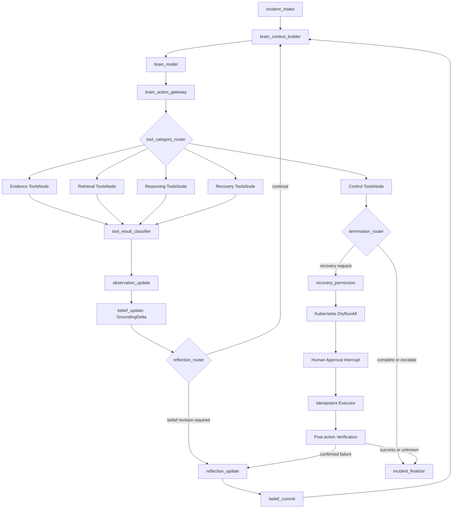
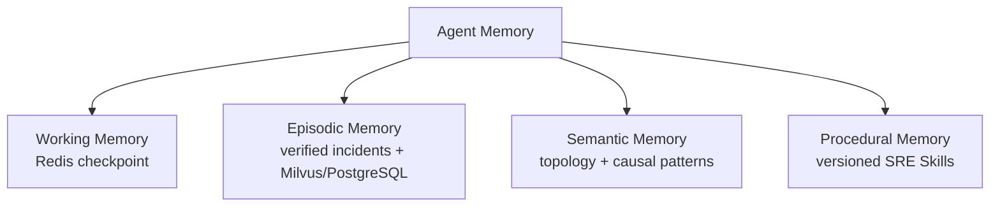

# KubePilot: An Eino-native Self-Reflective Autonomous SRE Agent Runtime

[English](README.md) | [简体中文](README.zh-CN.md)

KubePilot is an Eino-native autonomous SRE Agent whose LLM Brain owns investigation, open-world hypotheses, belief revision, diagnosis, and recovery planning. Its Runtime is the evidence-grounded environment and Safety Kernel:

> Observe → Ground → Revise belief → Act → Verify → Safe recovery or human escalation

The Runtime can return evidence, contradictions, validation coverage, and causal-path coverage. It cannot generate KubePilot hypotheses, choose the final root cause, judge whether a mechanism is plausible, change model confidence, or replace an LLM diagnosis with a deterministic candidate. No hidden chain-of-thought is stored; only structured plans, actions, evidence, grounding, beliefs, reflections, and lineage are audited.

No checked-in benchmark result claims that KubePilot is better than a baseline. A superiority claim is valid only after a formal paired run produces a positive 95% confidence interval against the best baseline.

## Architecture



`WorkflowState` is the sole mutable state. Eino `ChatModelNode` owns Brain calls, category-isolated `ToolsNode`s own capabilities, and Lambda nodes own context, routing, persistence, policy, and Safety Kernel boundaries. Every Brain, Tool, Grounding, Reflection, approval, and verification boundary is checkpointed. The graph has a step budget derived from the cognitive budget but no Agent or Incident wall-clock limit.

Tool results are typed as `EVIDENCE`, `VALIDATION`, `CONSTRAINT`, `ERROR`, or `STATE_CHANGE`. Constraint and infrastructure results never become incident evidence. Every result carries tool, schema, collector, target, time-window, parser, artifact, Evidence ID, and—after mutation—approval/resource-version provenance.

The Runtime emits non-probabilistic `GroundingLevel`, supporting/contradicting Evidence IDs, and obligation coverage. `GroundingDelta` states what changed objectively; only an LLM Reflection may emit a subjective `BeliefDelta`. Statement, mechanism, target, or falsification changes create immutable hypothesis revisions with explicit lineage.

Versioned fine-grained Skills are executable capability contracts rather than one large prompt. Each declares preconditions, server-owned inputs, procedure, allowed tool categories, required IDs, output contract, stop/failure conditions, handoff, dependencies, conflicts, and phase compatibility. Skill, model, tool-schema, and policy hashes are frozen in an `ExecutionSnapshot`; resume requires the same snapshot, while migration creates a new Workflow Attempt and invalidates stale diagnosis/recovery artifacts.

## Diagnosis strategies and MVP baselines

`diagnosis_method` selects a production execution path, not a report label:

| Strategy | Production behavior |
|---|---|
| `rule-only` | Deterministic Signal → State Assertion → Candidate → Objective Arbitration; no cognitive model call and no causal/falsification stage. |
| `evidence-only` | Deterministic Evidence → Signal → State Assertion → Candidate → Causal/Falsification → Objective Arbitration; no cognitive model call. |
| `cognitive` | Evidence-only plus the bounded Cognitive Interpreter and Comparator; cognitive output cannot affect objective gates. |
| `active-diagnosis` | Cognitive Runtime plus the two-round, server-valued Planner/Investigator loop. |
| `react` | One bounded Diagnosis ReAct agent with Metric, Log, Trace, and Kubernetes tools; no Planner, debate, long-term memory, or causal enhancement. |
| `direct`, `rag` | Compatibility baselines: one structured model call without, or with, scoped Episodic Memory. |
| `kubepilot` | Eino-native LLM Brain with open-world hypothesis lineage, evidence grounding, reflection, versioned Skills, and safe recovery. |
| `kubepilot-no-reflection` | KubePilot Brain ablation with the Reflection path disabled. |
| `kubepilot-no-optional-skills` | KubePilot Brain ablation with optional Skill activation disabled. |

Legacy request values are accepted for one compatibility window: `llm-only → direct` and `vector-rag → rag`. Incidents and artifacts persist only canonical IDs. Formal comparisons keep all baselines independent and add KubePilot Brain plus the two ablations under the same model profile, collectors, 8192-token response cap, recovery path, approval policy, executor, and verification controller.

The comparison writer rejects a run when strategy footprints do not differ as specified. This prevents labels from accidentally measuring the same runtime.

## Memory architecture



`MemoryService` provides one read, verified-write, and access-audit boundary. Working memory contains the current plan, evidence, hypotheses, debate, and interruption state and expires seven days after terminal state. Long-term retrieval applies a 90-day half-life, records the query hash, returned IDs, scores, scope, and consuming Agent, and enforces cluster plus namespace isolation. Generic curated procedures and patterns may be explicitly global; learned tenant data is scoped.

Agents have read/proposal access only. The server-side learner accepts a long-term write only for a resolved, approved, successfully verified production incident with at least two independent evidence sources and no unresolved infrastructure error. Evaluation incidents are excluded from learning.

## Causal incident intelligence

KubePilot currently implements **causal-aware reasoning and causal pattern mining**, not unrestricted causal discovery. The canonical model uses:

- Nodes: `cause`, `mechanism`, `symptom`, `observation`, `action`, `outcome`.
- Edges: `causes`, `manifests_as`, `supports`, `contradicts`, `mitigates`, `verifies`, `correlates`.

Actions mitigate causes; they are not effects of symptoms. Verification links actions to outcomes. Topology is propagation context and never becomes a causal edge by itself. Loki, Jaeger, or Kubernetes provenance alone is not an anomaly: deterministic parsing must first establish an abnormal observation.

The former evolving pattern store is migrated into the canonical `causal_patterns` table. A learned candidate requires three independent resolved incidents, average evidence confidence of at least `0.80`, contradiction at most `0.10`, at least two source types, and successful recovery or explicit human confirmation before activation. Candidates move through `candidate → validating → active/rejected`; operators can disable and roll back knowledge.

## Safety-governed recovery

Recovery can propose only `restart_pod`, `scale_deployment`, or `rollback_deployment`. It cannot discover mutation, approval-data, or verification capabilities. Execution requires:

- a proposal validated with Kubernetes `DryRunAll`;
- an unexpired server-generated approval context;
- namespace allowlist membership;
- matching incident, proposal, UID, resource version, and mutation hash;
- an idempotency key;
- deterministic post-action verification with consecutive healthy samples.

Approval bypass, namespace violation, and duplicate mutation are protected invariants. Budget exhaustion, unresolved debate, stale targets, missing approval, or failed verification moves the Incident to explicit attention/failure states instead of forcing a recovery.

## Autonomous SRE Benchmark

The benchmark directory contains datasets, injectors, public-boundary runners, evaluator-only labels, statistics, and report writers. Production orchestration, retrieval, reasoning, memory, causal learning, safety, and telemetry remain outside `benchmark/`; there is no benchmark-only diagnosis implementation.

The catalog expands deterministically to 120 scenarios:

| Fault family | Cases |
|---|---:|
| CPU | 20 |
| Memory | 20 |
| Database | 20 |
| Network | 20 |
| Deployment | 20 |
| Dependency | 20 |

It includes payment latency caused by a payment-pod memory leak, Redis unavailability, real held-session MySQL connection saturation, wrong deployment configuration, CPU throttling, OOM, network policy, probe, image, selector, and dependency variants.

Each family contributes four Dev, four Validation, and twelve hidden Test scenarios. A formal Test comparison runs 72 scenarios with three paired load/fault seeds: 216 paired cases per strategy. Strategy order is deterministically rotated per parent Run ID, and the Kubernetes baseline is restored and checked before every case.

The main table reports Strict Diagnosis Accuracy, Recovery Success, Safety Violations, mean model cost, and P95 latency. Reports also preserve category, variant, service, resource, evidence, calibration, tool-complexity, and failure breakdowns. `ToolCost` is a complexity unit, never currency; monetary cost uses separate prompt, visible completion, reasoning-token, and pricing-snapshot fields for every diagnosis and recovery-proposal model call.

The Brain evaluation additionally treats **Hypothesis Correction Rate**, **Grounded Decision Rate**, and **Tool Efficiency** as first-class outcomes. It separately reports Semantic RCA, Hypothesis Top-K, Reflection precision, Skill adherence/drift, Admission precision, unsupported hypotheses, and recovery safety. A grounded decision requires cited Evidence, validation of the final immutable revision, complete lineage, matching evidence/execution snapshots, and complete Tool provenance; every automatically recovered diagnosis must satisfy this contract.

Statistics are fixed in code:

- paired McNemar tests for diagnosis and recovery;
- paired Wilcoxon signed-rank tests for cost and latency;
- category-stratified 95% bootstrap confidence intervals;
- Holm correction across baseline comparisons;
- absolute differences, relative changes, and effect sizes.

Infrastructure failures are separated from model failures. More than 2% infrastructure failure or any protected safety violation invalidates the formal run. The comparison produces a parent manifest, per-strategy manifests, JSON, system/comparison/breakdown CSV tables, Markdown, paired statistics, a failure list, and per-case checkpoints. Reports read exact parent-referenced artifacts and never guess the newest file.

Validate the catalog and manifest without a cluster:

```bash
make benchmark-validate
go run ./cmd/benchmark environment --manifest benchmark/manifests/default.yaml
```

Run the paired formal comparison:

```bash
make benchmark-standard
```

Run the causal-memory ablation through the same production KubePilot path:

```bash
make benchmark-causal-ablation-report
```

This runs `no-causal`, `static-causal`, `learned-causal`, and `full` on paired cases, then reports diagnosis accuracy, recovery success, evidence efficiency, 95% confidence intervals, McNemar/Wilcoxon tests, and Holm-adjusted p-values. It does not substitute an offline proxy for live recovery outcomes.

The Make targets share `BENCHMARK_RUN_ID` and `BENCHMARK_ARTIFACT_DIR`, so downstream Agent, Recovery, Autonomous, and suite reports consume artifacts from that exact run. A full opt-in suite is:

```bash
make benchmark-full
```

Generated results remain under `artifacts/` and are not source-controlled.

## Offline policy improvement

The learning service performs bounded offline policy improvement rather than online reinforcement learning. It may propose changes only to Planner task weights, memory ranking, hypothesis/arbiter weights, and debate gates. A candidate is evaluated on fixed replay data, then may enter shadow mode and staged rollout at 5%, 25%, and 100%.

Promotion requires at least a three-percentage-point strict RCA gain, a positive lower confidence bound, no recovery regression, zero protected safety violations, and cost/latency guardrails. Recovery tool allowlists, namespaces, approvals, mutation implementations, and safety gates are immutable to the learner. Every candidate and evaluation is persisted; rollback points to the previous active policy.

## Runtime stack

- Go, Gin, Eino ADK, and `client-go`.
- Prometheus metrics, Loki logs, Jaeger traces, and Kubernetes topology.
- PostgreSQL audit/business state, Redis checkpoints, and Milvus vector retrieval.
- An independent Log Indexer using Drain3 plus embeddings; Drain3 is not on the incident query path.
- OpenAI-compatible or Anthropic-compatible streaming chat with tool calling; OpenAI-compatible embeddings and optional reranking.

## Configuration and local deployment

```bash
cp .env.example .env
make bootstrap
make doctor
make up
```

At minimum configure `API_TOKEN`, `ALERTMANAGER_WEBHOOK_TOKEN`, the chat endpoint/model/key, and the embedding endpoint/model/key. Optional reranking and per-million-token prices are documented in `.env.example`. Secrets remain in the untracked `.env`; logs, health endpoints, checkpoints, and manifests store hashes or redacted identities.

Useful local endpoints:

| Component | URL |
|---|---|
| KubePilot | http://localhost:8080 |
| Grafana | http://localhost:3000 |
| Prometheus | http://localhost:9090 |
| Alertmanager | http://localhost:9093 |
| Loki | http://localhost:3100 |
| Jaeger | http://localhost:16686 |

`/readyz` checks PostgreSQL, Redis, and the Agent Registry. The benchmark preflight additionally verifies the model, embeddings, reranker when enabled, Prometheus, Loki, Jaeger, Kubernetes access, and a clean baseline.

## API and auditability

The OpenAPI specification is in `api/openapi.yaml`. Relevant endpoints include:

- `POST /api/v1/incidents` with the independent baselines, `kubepilot`, or either KubePilot ablation.
- `GET /api/v1/incidents/{id}/investigation` for Brain turns, Skills, typed Tool provenance, hypothesis lineage, Grounding/Belief deltas, diagnosis, termination, and recovery without hidden reasoning.
- `POST /api/v1/incidents/{id}/workflow-attempts/migrate` for explicit snapshot migration and stale-artifact invalidation.
- `GET /api/v1/incidents/{id}/agent-runs` for strategy, architecture, hierarchy, model usage, tools, budgets, and safety events.
- `POST /api/v1/benchmarks/runs` for strategies, split, seeds, repetitions, model profile, and auto-approval policy.
- `GET /api/v1/benchmarks/runs/{id}/results` for the exact persisted result artifact.
- `POST /api/v1/knowledge/causal-patterns/{id}/rollback` for operator-authenticated restoration of an audited pattern revision.

Model calls record prompt, completion, reasoning tokens, latency, estimated price, phase, Agent, and parent Agent. Memory accesses, hypotheses, confidence transitions, safety feedback, proposals, approvals, mutations, and verification remain auditable without persisting Chain-of-Thought.

## Verification

```bash
go test ./...
go vet ./...
go test -race ./...
```

Architecture tests reject production imports of benchmark packages and benchmark-side copies of production runtime logic. Other tests cover strategy footprint differences, Planner bounds, worker degradation, blind alternatives, debate limits, arbitration, scoped memory, causal edge semantics, learning eligibility, approval interruption, checkpoint resume, idempotency, paired statistics, artifacts, migration-facing store contracts, and compatibility aliases.
