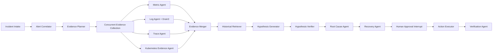

# KubePilot-AIOps

[English](README.md) | [简体中文](README.zh-CN.md)

KubePilot is an agentic AIOps system for local Kubernetes incident diagnosis and recovery. Its core is a typed Eino Graph that coordinates evidence agents, retrieval, hypothesis verification, constrained Tool Calling, human approval, recovery, and post-action verification.

The control plane is implemented in Go with Gin and Eino. It receives Alertmanager events, correlates alerts, collects metrics/logs/traces/Kubernetes evidence, performs evidence-grounded diagnosis, proposes a constrained recovery action, pauses for approval, executes through `client-go`, and verifies the result. Prometheus, Loki, Jaeger, Milvus, PostgreSQL, Redis, and the official Drain3 parser provide the Agent's evidence and state infrastructure.

## Architecture

```text
Minikube: gateway → order → payment → MySQL/Redis
    │          metrics / logs / OTLP traces
    ▼
Docker Compose: Agent + PostgreSQL + Redis + Prometheus + Loki + Jaeger
                + Grafana + Milvus + Drain3 WebSocket sidecar
```

The Go Log Agent sends batches to Drain3 over `ws://drain3:8081/ws/v1/parse`. Requests are versioned and idempotent; the sidecar keeps a ten-minute response cache and persists its miner snapshot.

## Agent architecture



- **Typed Eino orchestration:** `compose.Graph[*WorkflowState, *WorkflowState]` defines the Incident lifecycle as explicit nodes instead of an opaque prompt chain. The evidence node fans out to four specialized collectors concurrently and merges their results into one typed state.
- **Evidence-grounded reasoning:** the Diagnosis Agent generates at most three hypotheses, attaches supporting Evidence IDs and falsification conditions, and routes confidence below `0.80` to `NEEDS_ATTENTION` instead of forcing an answer.
- **Schema-constrained Tool Calling:** diagnosis and recovery use JSON Schema tools with fixed action/category contracts. Unknown evidence citations, malformed arguments, arbitrary shell commands, and unsupported actions are rejected; structural repair is bounded to one attempt.
- **Streaming model adapters:** both OpenAI-compatible and Anthropic-compatible protocols are supported. SSE text and fragmented Tool Calling arguments are assembled incrementally, while URL, API key, and model name remain user-configured.
- **Capability gating:** the Agent performs a side-effect-free Tool Calling probe before enabling recovery. A chat endpoint that cannot produce the required structured tool call remains diagnosis-disabled rather than executing an unsafe fallback.
- **Agentic retrieval:** the Log Agent combines Loki metadata filtering, Drain3 templates, OpenAI-compatible embeddings, and Milvus history. Historical memory is held out from Benchmark ground truth to prevent evaluation leakage.
- **Human-in-the-loop recovery:** the Recovery Agent can propose only `restart_pod`, `scale_deployment`, or `rollback_deployment`. Execution requires an unexpired proposal, approval, idempotency key, namespace allowlist, and Kubernetes UID/resourceVersion preconditions.
- **Closed-loop verification:** after execution, the Verification Agent samples workload health repeatedly and persists the final Incident, proposal, approval, audit, and verification state in PostgreSQL.
- **Agent observability:** every Eino node emits an OpenTelemetry span. Tool, workflow, and infrastructure failures are separated in Incident and Benchmark results rather than being hidden inside model output.
- **Ablation-ready design:** the same runner can evaluate `llm-only`, `vector-rag`, and full `kubepilot` paths, making the contribution of retrieval and multi-source agents measurable.

## Prerequisites

- macOS or Linux with at least 16 GB RAM; 24 GB available to containers is recommended.
- Go 1.26.2.
- Docker/Colima, Minikube, kubectl, and Helm.
- One OpenAI-compatible or Anthropic-compatible chat endpoint with tool calling.
- One embedding model exposed through an OpenAI-compatible embeddings endpoint.

Size the container runtime and Minikube allocations for the available host resources. Keep sufficient memory for PostgreSQL, the observability stack, Milvus, and the Kubernetes workloads when running the full benchmark.

## Configuration

```bash
cp .env.example .env
```

Required settings:

```env
API_TOKEN=...
ALERTMANAGER_WEBHOOK_TOKEN=...
CHAT_PROTOCOL=openai-compatible       # or anthropic-compatible
CHAT_BASE_URL=https://...
CHAT_API_PATH=/chat/completions       # /v1/messages for Anthropic
CHAT_API_KEY=...
CHAT_MODEL=...
CHAT_MAX_RETRIES=1                    # retry timeout, 429, and 5xx once
CHAT_REASONING_EFFORT=low            # optional for reasoning models
EMBEDDING_BASE_URL=https://...
EMBEDDING_API_PATH=/embeddings
EMBEDDING_API_KEY=...
EMBEDDING_MODEL=your-embedding-model
EMBEDDING_DIMENSIONS=1024
EMBEDDING_BATCH_SIZE=10               # lower this if the provider caps batch input
EMBEDDING_REQUEST_INTERVAL=1s         # provider rate-limit pacing; 429/5xx are retried
DRAIN3_TOKEN=...
```

Secrets are read only from environment variables or the untracked `.env`. Health responses, logs, traces, and benchmark manifests never include keys.
The Docker build context also excludes `.env`, generated runtime credentials, and benchmark artifacts.

Chat requests always set `stream: true`. OpenAI-compatible SSE deltas aggregate text and indexed tool-call argument fragments; Anthropic-compatible SSE aggregates text blocks and `input_json_delta` tool arguments. Providers that ignore streaming and return a normal JSON response remain contract-compatible. Tool calling is probed with bounded retries before recovery is enabled.

The checked-in Alertmanager development receiver uses `change-alert-token`; set the same value in `.env` for the first local run or replace it in `deploy/docker/alertmanager/alertmanager.yml`.

## Local deployment

```bash
make bootstrap
make doctor
make up
```

`make up` performs these stages:

1. Starts Colima and a Calico-enabled Minikube cluster.
2. Generates a container-safe kubeconfig and Prometheus client credentials under `.runtime/`.
3. Starts PostgreSQL, Redis, Drain3, Prometheus, Alertmanager, Loki, Grafana, Jaeger, Milvus, and dependencies.
4. Builds and loads the Go demo-service image.
5. Deploys demo and benchmark namespaces plus Alloy and kube-state-metrics.
6. Starts the Go Agent.

Local endpoints:

| Component | URL |
|---|---|
| KubePilot | http://localhost:8080 |
| Grafana | http://localhost:3000 |
| Prometheus | http://localhost:9090 |
| Alertmanager | http://localhost:9093 |
| Loki | http://localhost:3100 |
| Jaeger | http://localhost:16686 |

Stop while preserving data with `make down`. `make destroy` explicitly confirms before deleting the Minikube cluster and Compose volumes.

## Ten-minute demonstration

1. Open KubePilot and enter `API_TOKEN` in the local UI.
2. Confirm model configuration:

   ```bash
   curl -H "Authorization: Bearer $API_TOKEN" http://localhost:8080/api/v1/model/health
   curl -X POST -H "Authorization: Bearer $API_TOKEN" http://localhost:8080/api/v1/model/probe
   ```

3. Send traffic to the gateway:

   ```bash
   kubectl -n kubepilot-demo port-forward service/gateway-service 18080:8080
   curl http://localhost:18080/checkout
   ```

4. Create a controlled fault in the benchmark namespace:

   ```bash
   make benchmark-smoke
   ```

5. Inspect the incident's evidence and recovery proposal, approve it in the UI, and observe verification.
6. Follow the correlated metrics, logs, and traces in Grafana and Jaeger.

## API

The versioned specification is at `api/openapi.yaml`. All `/api/v1` routes require `Authorization: Bearer <API_TOKEN>` except the Alertmanager endpoint, which uses its own webhook token. Recovery approval also requires `Idempotency-Key`.

Example manual incident:

```bash
curl -X POST http://localhost:8080/api/v1/incidents \
  -H "Authorization: Bearer $API_TOKEN" \
  -H 'Content-Type: application/json' \
  -d '{"severity":"critical","service":"payment-service","namespace":"kubepilot-demo","resource":"payment-service","summary":"HTTP 500 increased"}'
```

## Benchmark

The scenario catalog is not a collection of arbitrary shell commands. `benchmark/incidents.yaml` expands deterministically into exactly 100 typed cases:

| Category | Cases |
|---|---:|
| CPU | 20 |
| Memory leak/OOM | 20 |
| Database | 20 |
| Network | 20 |
| Deployment | 20 |

Validate without a cluster:

```bash
make benchmark-validate
```

Run profiles:

```bash
make benchmark-smoke       # 5 cases
make benchmark-standard    # all 100 cases, serial and isolated
make benchmark-diagnosis-compare # 100 cases each for LLM-only, Vector-RAG, and full KubePilot
make benchmark-correlation # send 100 ground-truth groups through the live Agent webhook
make benchmark-retrieval   # load 500,000 logs through Loki, Drain3, embeddings, and Milvus
make benchmark-full
```

`standard`, `correlation`, and `retrieval` source `.env`. Formal runs require a real tool-capable chat model and a real OpenAI-compatible embedding endpoint; local mock responses are contract-test data only and are never reported as formal results. The report records the actual embedding model and dimensions, so results from different models remain distinguishable.

Retrieval runs in the separate `kubepilot-retrieval` Compose project. It owns independent Loki (port 3200), Drain3 (port 8181), Milvus (port 19531), etcd, MinIO, Docker network, and volumes; it never writes to the Diagnosis/Agent observability or history stores. The project is force-recreated for formal runs, and Milvus collections are additionally isolated by run ID.

Interrupted runs can be resumed and reports regenerated with:

```bash
go run ./cmd/benchmark resume --run-id <run-id>
go run ./cmd/benchmark report --run-id <run-id>
```

The Kubernetes injector only executes compiled action types. It refuses namespaces other than `kubepilot-benchmark`, snapshots affected resources, runs one case at a time, and restores the baseline on success, failure, cancellation, or timeout. A cleanup failure stops the run.

Each run produces a manifest, case JSONL, summary JSON, CSV tables, and Markdown report under `artifacts/benchmark/<run-id>/`. Manifests include the catalog hash, model protocol/name, endpoint hash, seed, and versions, but no credentials.

Metrics include strict root-cause accuracy, category/service/resource accuracy, evidence recall, recovery decision accuracy, tool success, diagnostic/recovery latency, alert grouping precision/recall/F1, retrieval Recall@K/MRR, and P50/P95/P99. Values in `PLAN.md` are examples only; reports contain measured results.

The diagnosis comparison evaluates three methods against the same injected Kubernetes scenarios: `llm-only` receives only incident metadata, `vector-rag` receives incident metadata plus seeded historical incidents, and `kubepilot` collects Metric, Log, Trace, Kubernetes, and historical evidence. Root-cause localization requires exact category, one of the 21 canonical fault variants, service, and resource matching; strict accuracy additionally requires at least 50% required-evidence recall. Reports include per-category precision/recall/F1, a confusion matrix, evidence precision/recall and groundedness, Brier score, ECE, high-confidence error rate, and ten-bin confidence calibration.

Benchmark integrity rule: scenario ground truth is available only to the runner/scorer after diagnosis. Incident requests use an opaque observation window and generic summary; the Agent does not receive scenario IDs, injector names, expected evidence, allowed actions, or expected labels. Production diagnosis code must not contain per-case decision rules added in response to benchmark errors. Injector-specific code is limited to the benchmark environment and exists only to create and clean up faults. Historical retrieval is seeded exclusively from the independently versioned `benchmark/history.yaml` corpus into `kubepilot_history_v2`; `benchmark/incidents.yaml` is never used as Agent memory. The seed manifest records the history dataset hash and collection name.

## Development and verification

```bash
make test
make lint
```

Direct checks:

```bash
go test -race ./...
go vet ./...
docker compose -f deploy/docker/docker-compose.yml config --quiet
kubectl kustomize deploy/kubernetes/overlays/demo >/dev/null
kubectl kustomize deploy/kubernetes/overlays/benchmark >/dev/null
```

## Troubleshooting

- `make doctor` reports missing tools or a stopped Docker backend.
- If the Agent cannot access Kubernetes, rerun `make runtime` after Minikube restarts; its API port may have changed.
- If Prometheus has no Minikube data, inspect `deploy/docker/prometheus/generated/` and the `minikube-proxy` target.
- If Loki is empty, check `kubectl logs -n kubepilot-system daemonset/alloy` and ensure `host.minikube.internal:3100` is reachable.
- If Drain3 is unavailable, check `docker compose ... logs drain3`; the Agent treats log evidence as unavailable and will not fabricate it.
- If a diagnosis enters `NEEDS_ATTENTION`, inspect the evidence errors and model probe rather than lowering the confidence threshold.
- If a benchmark cleanup fails, restore the benchmark namespace before resuming. The runner intentionally refuses to continue in a dirty environment.
