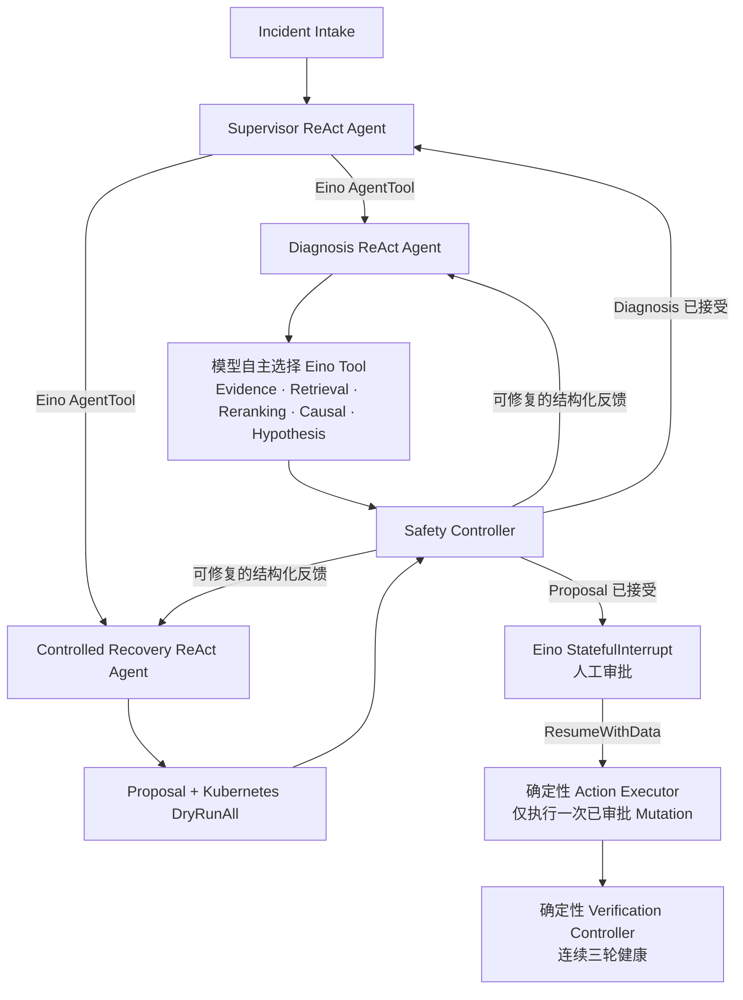

# KubePilot-AIOps

[English](README.md) | [简体中文](README.zh-CN.md)

KubePilot 是一个 Eino-native 的 **Constrained ReAct Kubernetes Autonomous SRE Agent**。三个嵌套的 Eino ADK Agent 自主选择受限的调查和恢复方案能力，确定性的 Safety Controller 负责不变量、审批、副作用执行和验证。

控制平面使用 Go、Gin 和 Eino 实现。系统接收 Alertmanager 事件、关联告警、收集指标/日志/Trace/Kubernetes 证据，执行基于证据的根因诊断，生成受约束的恢复方案，在人工审批后通过 `client-go` 执行动作并验证结果。Prometheus、Loki、Jaeger、Milvus、PostgreSQL、Redis 和官方 Drain3 解析器为 Agent 提供证据与状态基础设施。

## 架构

```text
Minikube：gateway → order → payment → MySQL/Redis
    │          指标 / 日志 / OTLP Trace
    ▼
Docker Compose：Agent + Log Indexer + PostgreSQL + Redis + Prometheus
                + Loki + Jaeger + Grafana + Milvus + Drain3 Sidecar
```

Drain3 不在 Incident 查询关键路径中。独立 Go Log Indexer 持续消费 Loki，通过带请求标识且幂等的 WebSocket 批量调用 Drain3，使用用户配置的 BGE endpoint 生成向量，并将模板索引写入 PostgreSQL 和 Milvus。查询阶段只读取 Loki 与预构建索引；索引不新鲜时回退 Loki。

## Agent 架构



- **Constrained ReAct，而不是写死调查 Graph：** 每个业务 ToolCall 都由模型选择，Agent 可以改变 Tool 顺序或并行调用。外层 Eino Graph 只保留确定性安全骨架：Intake、Agent、Proposal 校验、审批 Interrupt、精确执行、验证和 Finalizer。
- **只有三个嵌套 ADK Agent：** Supervisor 作为 Incident Commander，通过 Eino AgentTool 委托；Diagnosis 自主探索证据和可证伪假设；Recovery 只生成并 Dry-run 一个 Proposal。Recovery 无法发现 Mutation、Approval Data 或 Verification Tool。
- **固定 Agent Skill：** 每个 Agent 通过 Eino Middleware 注入独立 `SKILL.md`。Skill 只描述角色、边界、判断标准、能力语义和输出 Schema，不包含隐藏 Tool 顺序。Skill hash 与 Incident/Checkpoint 绑定，指令变化后不能静默恢复旧 Workflow。
- **Safety 是反馈环境：** 可修复问题以带 Scope 的 `SafetyFeedback` Observation 返回同一个 ReAct 循环，只描述缺失条件，不指定 Tool 或泄露答案；Fatal 违规立即停止，基础设施失败或 Correction Budget 耗尽时请求人工。
- **Agent 独立预算：** Supervisor、Diagnosis 和 Recovery 分别限制 Iteration、Tool Uses、Provider Token 与 Correction 次数；默认每个 Agent 有 50 次 Tool Uses。并行调用原子计费，Resume 不会重置用量。Tool Cost 和 Incident 汇总只用于遥测，不参与执行拦截。
- **类型安全且可恢复：** 命名的 WorkflowState、Evidence Schema、Dry-run 结果和服务端生成的 ExecutionContext 存入 Redis checkpoint；PostgreSQL 保存可审计的长期业务状态。
- **Evidence-driven Hypothesis Lifecycle：** Evidence 先按时间、Service/Resource、Trace/Request/Pod 和因果贡献进行归属与排序。Diagnosis 最多维护三个假设，经历 `CREATED → EVIDENCE_SEARCHING → SUPPORTED/REFUTED → ACCEPTED`；支持证据与反证变化会使置信度上升或衰减，模型先验是权重最低的正项。
- **真正的 Hybrid Incident Retrieval：** 三个并行 Eino Tool 分别从 Milvus 语义索引、PostgreSQL 全文索引和跨服务拓扑召回候选；Weighted RRF 保留 30 个候选，确定性特征重排只将 Top 5 送入诊断，并持久化全部分项得分和排序原因。
- **可选 Neural Reranker API：** Evidence 与历史 Incident 使用两套独立的排序策略和融合公式：Evidence 为 `0.70 deterministic + 0.30 neural`，历史 Incident 为 `0.45 deterministic + 0.55 neural`。用户可配置 OpenAI-compatible Reranker API 补充神经相关度；未启用时明确标记并重新归一化确定性权重，不伪造神经分数。结果持久化 `EvidenceRankBreakdown` 与 `IncidentRankBreakdown`，配置支持热加载并通过 hash 固定到 Incident。
- **Topology-aware Reasoning：** Jaeger 调用关系、Kubernetes Service/Endpoint 与 Owner 关系、已知数据依赖和错误传播路径构成 Incident Dependency Graph，因此不同服务通过相同关键依赖失败时也能跨服务召回。
- **因果知识：** 内置和增量学习的 cause-to-symptom 路径保存在 PostgreSQL 并保留审计。只有配置允许的非评测 namespace 中，经过审批且连续验证成功的高置信 Incident 才能提供学习样本；同一规范化模式至少需要两个独立 Incident 才能自动激活。
- **持续演化的 Incident Knowledge：** Resolved Incident 经过独立 Knowledge Evolution Layer。Trace/Kubernetes/Evidence 图会把 Pod/IP 等实例归一化为可复用的 `business-service → database/cache/queue` 模式，按确定性签名合并并服务后续拓扑检索。Causal Proposal 必须来自已接受的 Hypothesis Ledger 和真实 Evidence，经过完整路径、独立来源、反证与重复支持校验后才能进入 pending/active 知识。Agent Tool 只能读取、提出和校验，只有服务端 Resolved-Incident Extractor 可以写入。
- **因果模式发现：** 独立的服务端 Discovery Engine 将多个已验证的 Resolved Incident 提取为 Incident Causal Graph，挖掘重复因果路径并记录反例，使用确定性评分后复用现有 Causal Validator；只有通过校验的候选模式才能入库。Diagnosis 只能通过 `retrieve_discovered_causal_patterns` 读取已接受模式，不能写入或提升模式状态。
- **发现评测：** `go run ./cmd/benchmark intelligence` 包含固定的 100 个 Resolved Incident 发现数据集，输出 Pattern Precision/Recall 和 Confidence Calibration；该评测与生产知识学习及正式故障注入评分隔离。
- **统一 Capability Registry：** 所有类型化 handler、嵌套 AgentTool 和确定性 Action 都组合为同一个 `tools.Capability` contract，并且只能通过 `tools.Registry` 进入 Eino。Registry 统一负责 JSON Schema 校验、节点 allowlist、timeout、输入/输出限制、审批要求和 ToolsNode 构造。Tool 不接受原始 SQL、PromQL、LogQL、kubectl、Shell、Milvus filter 或任意 Kubernetes manifest；架构测试禁止替代注册路径和生产 Agent 主链路手工构造业务 `schema.ToolCall`。
- **官方流式模型组件：** OpenAI-compatible 和 Anthropic-compatible 均使用锁定版本的 Eino 扩展。Eino 负责合并流式 Tool Call 分片；URL、API Path、API Key 和模型名完全由用户配置。
- **能力门控：** 启用恢复能力前，Agent 会执行无副作用的 Tool Calling 探测。无法生成指定结构化工具调用的 endpoint 不会进入真实恢复模式。
- **预索引 Hybrid Log：** 查询 Tool 组合 Loki metadata/keyword 与持续维护的 Drain3/BGE/Milvus 索引，不会等待同步日志解析。
- **Human-in-the-loop 恢复：** Recovery 只能提出 `restart_pod`、`scale_deployment` 或 `rollback_deployment`。Kubernetes `DryRunAll` 成功后才能审批；执行还必须校验服务端 ExecutionContext、幂等键、namespace allowlist、mutation hash、UID 和 resourceVersion。
- **闭环验证：** 动作完成后，确定性的 Verification ToolsNode 连续采样工作负载健康状态，并将最终 Incident、Proposal、审批、审计和验证状态持久化到 PostgreSQL。
- **不记录思维链的 Agent 可观测性：** Eino Callback 持久化 Tool 生命周期、预算、Hypothesis Transition、Confidence History、带 Scope 的 Safety Feedback 与 `AgentDecisionEvent` 动作类别，并输出到 OpenTelemetry、Prometheus、PostgreSQL 和 Incident SSE；不记录隐藏推理、凭据、完整 Endpoint 或未裁剪原始日志。
- **可消融评测：** 同一个 Runner 可以评测 `llm-only`、`vector-rag` 和完整 `kubepilot` 路径，从而量化历史检索与多源 Agent 带来的贡献。

## 环境要求

- macOS 或 Linux，至少 16 GB 内存；建议为容器提供 24 GB 可用内存。
- Go 1.26.2。
- Docker/Colima、Minikube、kubectl 和 Helm。
- 一个支持 Tool Calling 的 OpenAI-compatible 或 Anthropic-compatible 对话模型 endpoint。
- 一个提供 OpenAI-compatible Embeddings API 的 Embedding 模型 endpoint。

请根据宿主机可用资源配置容器运行时和 Minikube。执行完整 Benchmark 时，需要为 PostgreSQL、观测组件、Milvus 和 Kubernetes 工作负载预留足够内存。

## 配置

```bash
cp .env.example .env
```

必填配置：

```env
API_TOKEN=...
ALERTMANAGER_WEBHOOK_TOKEN=...
CHAT_PROTOCOL=openai-compatible       # 或 anthropic-compatible
CHAT_BASE_URL=https://...
CHAT_API_PATH=/chat/completions       # Anthropic 使用 /v1/messages
CHAT_API_KEY=...
CHAT_MODEL=...
CHAT_MAX_RETRIES=3                    # 每个模型请求最多重试三次
CHAT_REASONING_EFFORT=low             # reasoning 模型可选
CONFIG_RELOAD_INTERVAL=2s             # 无需重启 Agent，轮询挂载的 .env
CONFIG_RELOAD_RETRY_INTERVAL=30s      # 候选模型探测失败后的重试间隔
EMBEDDING_BASE_URL=https://...
EMBEDDING_API_PATH=/embeddings
EMBEDDING_API_KEY=...
EMBEDDING_MODEL=your-embedding-model
EMBEDDING_DIMENSIONS=1024
EMBEDDING_BATCH_SIZE=10               # provider 限制批量输入时可调低
EMBEDDING_REQUEST_INTERVAL=1s         # provider 限流节奏；429/5xx 会重试
RERANKER_ENABLED=false                # 可选的 OpenAI-compatible Reranker API
RERANKER_PROTOCOL=openai-compatible
RERANKER_BASE_URL=https://...
RERANKER_API_PATH=/reranks
RERANKER_API_KEY=...
RERANKER_MODEL=<your-reranker-model>
MODEL_EVIDENCE_MAX_ITEMS=12
MODEL_CONTEXT_MAX_BYTES=32768
SUPERVISOR_MAX_TOOL_USES=50
DIAGNOSIS_MAX_TOOL_USES=50
RECOVERY_MAX_TOOL_USES=50
CAUSAL_LEARNING_NAMESPACES=kubepilot-demo
DRAIN3_TOKEN=...
BUSINESS_PROBE_URL=...                # 可选的端到端恢复探针
```

ToolCall 上限按每个 Agent 独立执行。Tool Cost 和 Incident 汇总值仅用于可观测性，不参与执行拦截。

密钥只从环境变量或未纳入版本控制的 `.env` 读取。健康检查响应、日志、Trace 和 Benchmark manifest 均不会记录密钥；Docker 构建上下文也会排除 `.env`、运行时凭据和 Benchmark 产物。

所有 Agent 模型节点都使用 Eino 流式接口。OpenAI-compatible SSE delta 和 Anthropic `input_json_delta` 分片由 Eino 合并后才会执行 Tool。

Agent 会监听只读挂载的 `.env` 中的对话模型和 Reranker 配置变化。候选 Client 完成校验与探测后才原子替换当前 Client；失败时继续保留旧配置。每个 Incident 会固定 Model、Skill、Ranking Policy 和 Reranker hash；健康状态、日志和 Checkpoint 不会暴露 API Key 或完整 Endpoint。

仓库中的 Alertmanager 开发配置使用 `change-alert-token`。首次本地运行时，应在 `.env` 中配置相同值，或同时修改 `deploy/docker/alertmanager/alertmanager.yml`。

## 本地部署

```bash
make bootstrap
make doctor
make up
```

`make up` 依次执行：

1. 启动 Colima 和启用 Calico 的 Minikube 集群。
2. 在 `.runtime/` 下生成容器可用的 kubeconfig 和 Prometheus 客户端凭据。
3. 启动 PostgreSQL、Redis、Drain3、Prometheus、Alertmanager、Loki、Grafana、Jaeger、Milvus 及其依赖。
4. 构建并加载 Go demo-service 镜像。
5. 部署 demo、benchmark namespace，以及 Alloy 和 kube-state-metrics。
6. 启动 Go Log Indexer 和 Go Agent。

本地服务入口：

| 组件 | URL |
|---|---|
| KubePilot | http://localhost:8080 |
| Grafana | http://localhost:3000 |
| Prometheus | http://localhost:9090 |
| Alertmanager | http://localhost:9093 |
| Loki | http://localhost:3100 |
| Jaeger | http://localhost:16686 |

使用 `make down` 停止服务并保留数据。`make destroy` 会在明确确认后删除 Minikube 集群和 Compose volumes。

## 十分钟演示

1. 打开 KubePilot，在本地控制台中输入 `API_TOKEN`。
2. 检查模型配置：

   ```bash
   curl -H "Authorization: Bearer $API_TOKEN" http://localhost:8080/api/v1/model/health
   curl -X POST -H "Authorization: Bearer $API_TOKEN" http://localhost:8080/api/v1/model/probe
   ```

3. 向 gateway 发送流量：

   ```bash
   kubectl -n kubepilot-demo port-forward service/gateway-service 18080:8080
   curl http://localhost:18080/checkout
   ```

4. 在 benchmark namespace 创建受控故障：

   ```bash
   make benchmark-smoke
   ```

5. 查看 Incident 证据和恢复方案，在控制台审批，并观察验证过程。
6. 在 Grafana 和 Jaeger 中查看关联的指标、日志和 Trace。

## API

公开 API 规范位于 `api/openapi.yaml`。除 Alertmanager webhook 使用独立 token 外，所有 `/api/v1` 路由都要求 `Authorization: Bearer <API_TOKEN>`。恢复审批还必须提供 `Idempotency-Key`。

可通过 `/api/v1/knowledge/causal-patterns` 查看、启用或禁用因果模式；所有状态变更都会鉴权并写入审计。`/api/v1/incidents/{id}/hypotheses` 提供 Hypothesis Ledger，`/agent-runs` 提供不含隐藏推理的预算和决策事件；`/api/v1/reranker/health` 与 `/probe` 提供脱敏状态。

手动创建 Incident：

```bash
curl -X POST http://localhost:8080/api/v1/incidents \
  -H "Authorization: Bearer $API_TOKEN" \
  -H 'Content-Type: application/json' \
  -d '{"severity":"critical","service":"payment-service","namespace":"kubepilot-demo","resource":"payment-service","summary":"HTTP 500 increased"}'
```

## Benchmark

### Autonomous Incident Benchmark

除现有的真实故障注入档位外，仓库提供隔离的评测框架，代码位于 `benchmark/runner`、`benchmark/incident_retrieval`、`benchmark/log_retrieval`、`benchmark/evaluator`、`benchmark/reporter` 和 `benchmark/reports`。`benchmark/` 只包含数据集、执行适配、评测器、Manifest 和报告；Agent 编排、预算、遥测、检索排序、推理、安全与知识演化只在生产包实现一次，不存在 Benchmark 专用版本。`benchmark/manifests/autonomous.yaml` 保存可复现实验契约。

评测器将期望根因、证据、恢复动作和因果路径保留在 Agent 上下文之外，公开 API 请求只包含观测数据。仓库级 Audit Test 强制生产包与 Benchmark 的单向依赖边界，并计算 Recall@K、Precision@K、MRR、NDCG、Hypothesis、Tool Efficiency、自动修正、恢复安全、验证成功、MTTD/MTTR、Topology 和因果演化指标。

只校验契约而不启动线上 Benchmark：

```bash
go run ./cmd/benchmark environment
```

正式全量运行仍需显式使用现有 `make benchmark-*` 命令；生成的报告和运行日志不会进入源码目录或版本库。

场景目录不允许包含任意 Shell 命令。`benchmark/incidents.yaml` 会确定性展开为 100 个强类型场景：

| 类别 | Case 数量 |
|---|---:|
| CPU | 20 |
| Memory leak/OOM | 20 |
| Database | 20 |
| Network | 20 |
| Deployment | 20 |

无需集群即可验证场景：

```bash
make benchmark-validate
```

运行档位：

```bash
make benchmark-smoke       # 5 个 case
make benchmark-standard    # 全部 100 个 case，串行且相互隔离
make benchmark-correlation # 通过真实 Agent webhook 发送 100 组 ground-truth 告警
make benchmark-log-retrieval      # 仅通过 Loki 和 Drain3 处理 500,000 条日志
make benchmark-incident-retrieval # 结构化历史 Incident 排序
make benchmark-full
```

`standard`、`correlation` 和 `retrieval` 会读取 `.env`。正式运行必须使用真实、支持 Tool Calling 的对话模型和真实 OpenAI-compatible Embedding endpoint；本地 mock 只用于合同测试，不得作为正式结果。报告会记录实际 Embedding 模型和维度，确保不同模型的结果可以区分。

Retrieval 在独立的 `kubepilot-retrieval` Compose project 中运行，拥有独立的 Loki（端口 3200）、Drain3（端口 8181）、Milvus（端口 19531）、etcd、MinIO、Docker network 和 volumes，不会写入 Diagnosis/Agent 的观测或历史数据。每次运行都会在数据导入前删除并重建该 project 的 volumes，Milvus collection 还会按 run ID 进一步隔离。Diagnosis 和 Correlation 启动前会恢复 Kubernetes 健康基线，只清理 Agent/观测短期缓存；已完成的报告和运行元数据会保留。

中断后可以恢复运行或重新生成报告：

```bash
go run ./cmd/benchmark resume --run-id <run-id>
go run ./cmd/benchmark report --run-id <run-id>
```

Kubernetes Injector 只能执行编译进 Runner 的动作类型，拒绝操作 `kubepilot-benchmark` 以外的 namespace。Runner 会快照受影响资源、串行执行 case，并在成功、失败、取消或超时后恢复健康基线；清理失败会立即停止后续 case。

每次运行会在 `artifacts/benchmark/<run-id>/` 下生成 manifest、case JSONL、summary JSON、CSV 表格和 Markdown 报告。Manifest 包含场景 hash、模型协议/名称、endpoint hash、seed 和配置 hash，但不包含凭据。`artifacts/` 中的运行报告和日志不会提交到版本库。

指标包括严格根因准确率、category/service/resource 准确率、Evidence Recall、恢复决策准确率、Tool Count/Cost 与 Correction 使用量、Confidence History、诊断/恢复延迟、告警分组 Precision/Recall/F1，以及分离的日志模板和历史 Incident Recall@K/MRR/NDCG 与 P50/P95/P99。正式报告只使用实际测量结果。

Diagnosis 对比在相同 Kubernetes 故障场景上评估三种方法：`llm-only` 只接收 Incident metadata；`vector-rag` 接收 Incident metadata 和历史 Incident；`kubepilot` 收集 Metric、Log、Trace、Kubernetes 和历史证据。根因定位要求 category、21 种 canonical variant 之一、service 和 resource 完全匹配；严格准确率还要求 required-evidence recall 至少为 50%。报告包含分类 Precision/Recall/F1、混淆矩阵、Evidence Precision/Recall/Groundedness、Brier Score、ECE、高置信错误率和十档置信度校准。

Benchmark 完整性规则：场景 ground truth 只在诊断结束后提供给 Runner/Scorer。Incident 请求使用不透明的观测时间窗口和通用摘要；Agent 不会收到场景 ID、Injector 名称、期望证据、允许动作或期望标签。生产诊断代码禁止包含根据 Benchmark 错误追加的 per-case 决策规则。Injector-specific 代码只存在于 Benchmark 环境，用于创建和清理故障。历史检索只能从独立的 `benchmark/history.yaml` 写入 `kubepilot_history`；严禁使用 `benchmark/incidents.yaml` 生成 Agent 历史记忆。Seed manifest 会记录历史数据集 hash 和 collection 名称。

## 开发与验证

```bash
make test
make lint
```

直接执行：

```bash
go test -race ./...
go vet ./...
docker compose -f deploy/docker/docker-compose.yml config --quiet
kubectl kustomize deploy/kubernetes/overlays/demo >/dev/null
kubectl kustomize deploy/kubernetes/overlays/benchmark >/dev/null
```

## 排障

- `make doctor` 会报告缺失工具或未启动的 Docker backend。
- Agent 无法访问 Kubernetes 时，在 Minikube 重启后重新执行 `make runtime`；Kubernetes API 端口可能发生变化。
- Prometheus 没有 Minikube 数据时，检查 `deploy/docker/prometheus/generated/` 和 `minikube-proxy` target。
- Loki 没有数据时，检查 `kubectl logs -n kubepilot-system daemonset/alloy`，并确认 `host.minikube.internal:3100` 可访问。
- Drain3 不可用时，检查 `drain3` 和 `log-indexer` 服务。Incident 诊断会继续使用 Loki metadata，并将模板/向量索引标记为 stale；查询链路不会临时解析日志。
- Diagnosis 进入 `NEEDS_ATTENTION` 时，应检查证据错误和模型探测结果，不要降低置信度阈值。
- Benchmark 清理失败时，应先恢复 benchmark namespace 再继续。Runner 会拒绝在脏环境中执行后续 case。
