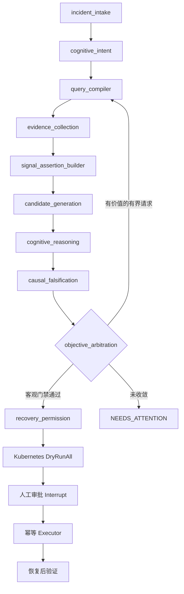
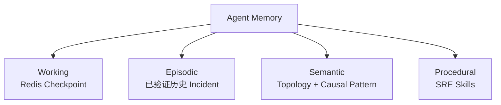

# KubePilot：带 Eino 认知层的证据锚定自治诊断 Runtime

[English](README.md) | [简体中文](README.zh-CN.md)

KubePilot 是一个基于 Eino 的 Kubernetes 自治 SRE 控制平面。MVP 核心链路为：

> Observe → Interpret → Request discriminative evidence → Update belief → Safe recovery or human escalation

模型负责规划、只读调查、提出和挑战假设、生成恢复建议；确定性的服务端代码负责 Evidence 身份、预算、置信门禁、租户边界、Dry-run、人工审批、幂等执行和恢复后验证。


## Agent 架构



每一个命名阶段都是共享 `WorkflowState`、callback、checkpoint 和 resume 语义的 Eino Graph Node。Eino 管理模型和工具生命周期；纯 Go 服务负责事实、Signal、State Assertion、Candidate 校验、因果覆盖、证伪、评分和安全门禁。Causal Engine 只能接收服务器签发的 Signal、State Assertion、Graph Node 和拓扑边 ID，不能用自然语言作因果推断。

Cognitive Runtime 是包含 Planner、Interpreter、Comparator 与 Investigator 四种受限操作的单一 Eino 组件。它可以解释已锚定 Observation、比较候选并提出区分性证据请求，但不能新增事实、创建可执行根因、修改 Objective Score 或授权恢复。当请求重复、不可用、没有新 Evidence、缺少未观测 Assertion，或 `DiagnosticValue = ExpectedEntropyReduction × DecisionImpact < 0.05` 时，服务端停止主动诊断循环。

Objective Arbiter 使用 `0.50 × Evidence + 0.30 × Causal + 0.20 × ObservationCoverage − 0.30 × Contradiction`。Evidence 是独立且按来源加权的支持；Observation Coverage 衡量不同异常状态、时间阶段与机制节点，禁止对同一 Signal 二次计分。只有 Objective Score、Margin 和 Gate 决定恢复资格。满足近似同分条件的 Cognitive Preference 只是序数偏好：只影响展示、下一轮候选对和人工审阅优先级，绝不影响置信度或自动化。

系统不请求、不保存 Chain-of-Thought，只持久化 `HypothesisArgument`、`Critique`、Evidence ID、评分变化和 `ArbitrationResult`。

## Diagnosis Strategy 与 MVP Baseline

`diagnosis_method` 会改变生产执行路径，而不只是写入一个标签：

| Strategy | 生产行为 |
|---|---|
| `rule-only` | 确定性的 Signal → State Assertion → Candidate → Objective Arbitration；无认知模型调用，也不运行 Causal/Falsification。 |
| `evidence-only` | 确定性的 Evidence → Signal → State Assertion → Candidate → Causal/Falsification → Objective Arbitration；无认知模型调用。 |
| `cognitive` | Evidence-only 加受限的 Cognitive Interpreter 与 Comparator；认知输出不能影响 Objective Gate。 |
| `active-diagnosis` | Cognitive Runtime 加最多两轮、由服务端计算价值的 Planner/Investigator 主动诊断。 |
| `react` | 单个受预算约束的 Diagnosis ReAct Agent，可使用 Metric/Log/Trace/Kubernetes 工具；无 Planner、Debate、长期 Memory 和 Causal 增强。 |
| `direct`、`rag` | 兼容 Baseline：一次结构化模型调用，分别不带、或带有 scoped Episodic Memory。 |
| `kubepilot` | 完整 active-diagnosis runtime 的兼容别名。 |

兼容输入 `llm-only → direct`、`vector-rag → rag`；持久化和评测 artifact 只写规范 ID。正式 MVP 对比固定使用 `rule-only`、`evidence-only`、`cognitive`、`active-diagnosis` 和 `react`，并共享模型 profile、Collector、单 Agent 输出上限、Recovery path、审批、执行器与验证控制器。

比较器会检查执行足迹：若标签实际产生相同 Runtime 轨迹，整次比较直接失败。

## Memory Architecture



统一 `MemoryService` 提供读取、已验证 Incident 写入和访问审计。Working Memory 保存当前 Plan、Evidence、Hypothesis、Debate 和中断状态，终态后保留七天。长期检索采用 90 天半衰期，并记录 query hash、返回 ID、评分、scope 和消费它的 Agent。

历史 Incident、向量检索、语义模式和 Procedural Memory 默认执行 cluster + namespace 隔离。显式全局的内置通用模式可以跨 scope 使用；生产学习产生的数据必须带 scope。Agent 只有读取和提议权限；只有服务端 Learner 能写入长期 Memory。

## Causal Incident Intelligence

当前能力准确称为 **causal-aware reasoning / causal pattern mining**，而不是无约束 causal discovery。

- Node：`cause`、`mechanism`、`symptom`、`observation`、`action`、`outcome`。
- Edge：`causes`、`manifests_as`、`supports`、`contradicts`、`mitigates`、`verifies`、`correlates`。

Action 通过 `mitigates` 指向 Cause，恢复验证通过 `verifies` 指向 Outcome。Topology 只提供传播上下文，不会自动成为因果边。Loki、Jaeger 或 Kubernetes 来源本身也不等于异常，必须先由确定性解析器确认异常 Observation。

旧的 evolving pattern 数据会迁移到统一 `causal_patterns` 表，然后移除第二套存储。模式至少需要三个独立生产 Incident、平均证据置信度不低于 `0.80`、矛盾分数不高于 `0.10`、两类以上证据源，以及成功恢复或人工确认，才可激活。状态为 `candidate → validating → active/rejected`，并支持禁用和回滚。

## Safety-governed Recovery

Recovery 只能提议：

- `restart_pod`
- `scale_deployment`
- `rollback_deployment`

Recovery Agent 无法发现 Mutation、Approval Data 或 Verification 能力。真实执行必须同时满足 Kubernetes `DryRunAll`、未过期的服务端审批上下文、namespace allowlist、Incident/Proposal/UID/resourceVersion/mutation hash 一致、幂等键有效以及恢复后连续健康验证。

`approval bypass`、`namespace violation`、`duplicate mutation` 是硬性安全不变量。预算耗尽、目标漂移、审批缺失、Debate 未收敛或验证失败都会进入显式异常状态，而不会自动降级安全门禁。

## Autonomous SRE Benchmark

`benchmark/` 只保存数据集、故障注入器、公共接口 Runner、评测标签、统计和报告代码。生产 Agent、Retrieval、Reasoning、Memory、Causal、Safety 与 Telemetry 不在该目录中，也不存在专门迎合 benchmark 的诊断逻辑。

场景目录确定性展开为 120 个 Case：

| 故障类 | 数量 |
|---|---:|
| CPU | 20 |
| Memory | 20 |
| Database | 20 |
| Network | 20 |
| Deployment | 20 |
| Dependency | 20 |

其中包含 payment pod memory leak 导致 Payment latency、Redis unavailable、真实 held-session MySQL connection saturation、wrong deployment config，以及 CPU throttling、OOM、NetworkPolicy、Probe、Image、Service selector 等变体。

每类四个 Dev、四个 Validation、十二个隐藏 Test。正式 Test 对 72 个场景运行三个相同的 load/fault seed，即每种 Strategy 216 个 paired cases。每个 Case 前都恢复并检查 Kubernetes baseline，Strategy 顺序按父 Run ID 确定性轮换。

固定统计方法：

- Diagnosis Accuracy / Recovery Success：paired McNemar test。
- Cost / Latency：paired Wilcoxon signed-rank test。
- 核心指标：按故障类别分层的 95% bootstrap CI。
- 多 baseline：Holm 校正。
- 同时报告绝对差值、相对变化和效应量。

基础设施失败与模型失败分开统计；比例超过 2% 时整次正式运行 invalid。`ToolCost` 只是工具复杂度，不是金额。真实 Cost 使用 prompt、visible completion、reasoning token 和运行时 price snapshot 计算。

同一条生产 KubePilot 路径还支持四组因果消融：`no-causal`、`static-causal`、`learned-causal`、`full`。报告使用真实成对 Case 的 RCA、Recovery Success 与 Evidence Efficiency，并输出 95% CI、McNemar/Wilcoxon 和 Holm 校正结果：

```bash
make benchmark-causal-ablation-report
```

一个 Comparison Run 只有一个父 Run ID，Case 主键包含 Strategy、Case、Seed 和 Repetition。基础设施失败超过 2%，或出现任何受保护安全违规，都会使正式运行无效。输出包含父 Manifest、各 Strategy Manifest、JSON、System/Comparison/Breakdown 三张 CSV、Markdown、显著性检验、失败清单和 checkpoint。报告必须读取父 Run 引用的精确 artifact，不会扫描“最新文件”。

```bash
make benchmark-validate
go run ./cmd/benchmark environment --manifest benchmark/manifests/default.yaml
make benchmark-standard
```

完整的检索、Agent、Recovery、Correlation 和 Autonomous 报告：

```bash
make benchmark-full
```

Make 会让所有下游报告共享 `BENCHMARK_RUN_ID` 与 `BENCHMARK_ARTIFACT_DIR`。生成结果保存在 `artifacts/`，不进入源码。

## 离线 Learning

Learning Service 只做安全的离线策略改进，不做在线 RL。允许优化 Planner 任务权重、Memory Ranking、Hypothesis/Arbiter 权重和 Debate 门限；不得修改 Recovery allowlist、namespace、审批、Mutation 实现和 Safety Gate。

候选策略必须经过固定 Replay、Shadow 和 5% → 25% → 100% 灰度。晋级要求 Strict RCA Accuracy 至少提升三个百分点、提升 CI 下界大于 0、Recovery 不下降、三个安全违规保持 0，且满足 Cost/P95 guardrail。策略和评测均持久化，回滚目标始终是上一条活动策略。

## 技术栈与本地运行

- Go、Gin、Eino ADK、`client-go`。
- Prometheus、Loki、Jaeger、Kubernetes Topology。
- PostgreSQL、Redis、Milvus。
- 独立 Drain3 + Embedding Log Indexer；Drain3 不在 Incident 查询关键路径。
- OpenAI-compatible 或 Anthropic-compatible 流式 Tool Calling；OpenAI-compatible Embedding 与可选 Reranker。

```bash
cp .env.example .env
make bootstrap
make doctor
make up
```

至少配置 API/Webhook Token、Chat endpoint/model/key 和 Embedding endpoint/model/key。完整字段见 `.env.example`。密钥只存在未跟踪的 `.env`；健康接口、日志、Checkpoint 和 Manifest 只保存哈希或脱敏身份。

`/readyz` 检查 PostgreSQL、Redis 和 Agent Registry。Benchmark Preflight 额外检查 Chat Model、Embedding、启用时的 Reranker、Prometheus、Loki、Jaeger、Kubernetes 权限和干净 baseline。

## API

OpenAPI 位于 `api/openapi.yaml`。核心接口包括：

- `POST /api/v1/incidents`：选择 `direct`、`rag`、`react` 或 `kubepilot`，并可设置受控的 causal mode。
- `GET /api/v1/incidents/{id}/investigation`：读取 Plan、Worker Findings、Debate 和 Arbitration，不返回隐藏推理。
- `GET /api/v1/incidents/{id}/agent-runs`：读取 Strategy、Architecture、父子 Agent、Token、Cost、Tool、Budget 与 Safety 事件。
- `POST /api/v1/benchmarks/runs`：设置 Strategies、Split、Seeds、Repetitions、Model Profile 和 Auto-approve。
- `GET /api/v1/benchmarks/runs/{id}/results`：读取该父 Run 持久化的精确结果 artifact。
- `POST /api/v1/knowledge/causal-patterns/{id}/rollback`：由显式 Operator 恢复已审计的模式修订，同时保留单调历史。

## 验证

```bash
go test ./...
go vet ./...
go test -race ./...
```

测试覆盖 Strategy 足迹差异、Planner 约束、Worker 降级、Alternative 盲化、Debate 上限、确定性 Arbitration、Memory scope、Causal Edge 语义、学习资格、审批中断、Checkpoint Resume、幂等 Mutation、配对统计、Artifact 绑定和旧 Diagnosis Method 映射。架构测试禁止生产包导入 benchmark，也禁止 benchmark 复制生产运行时逻辑。
